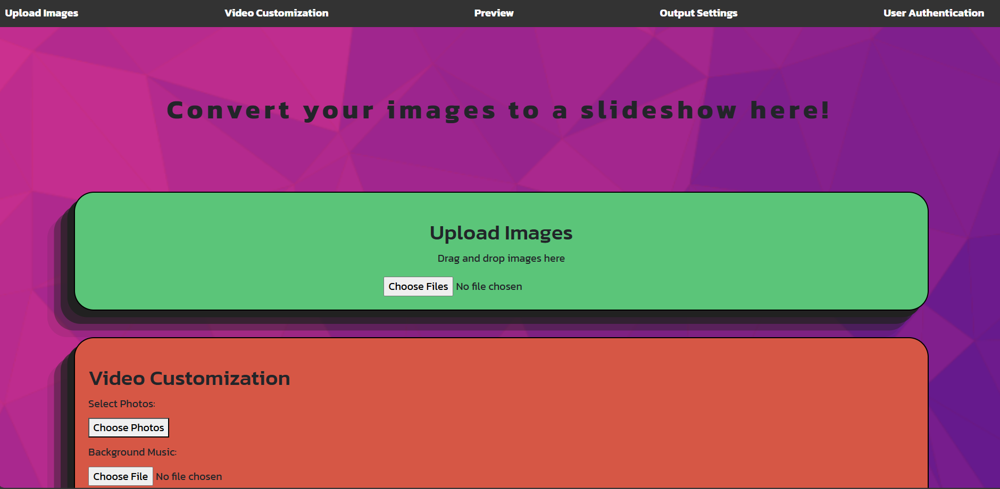
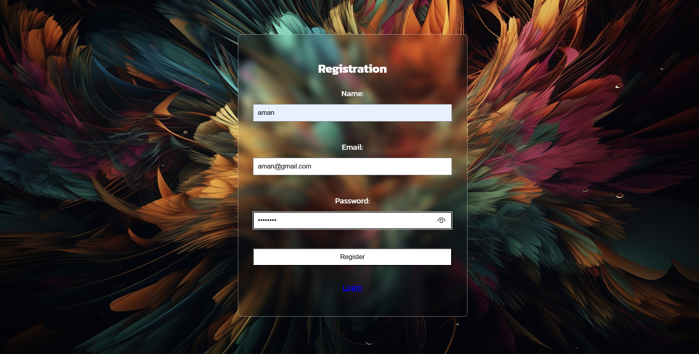

# 📸 SnapToScene


A full-stack web application built with **Flask**, allowing users to upload multiple images and background music to generate a **slideshow video**. The app supports user registration, login (JWT-based), admin dashboard, and video preview.

---

## ✨ Features

- 📁 Upload multiple images
- 🎵 Add background music
- ⏱️ Set image duration
- 🎬 Server-side video generation using MoviePy
- 🔐 User login & registration with JWT
- 👨‍💼 Admin login to view registered users
- 🎥 Preview and download the final video
- 🖥️ Built with HTML, CSS, JS (frontend) and Python Flask (backend)

---

## 🚀 Tech Stack

- **Frontend:** HTML5, CSS3, Bootstrap, JavaScript
- **Backend:** Python, Flask, JWT
- **Video Processing:** MoviePy
- **Authentication:** Flask-JWT-Extended, `users.txt` file-based storage

---

## 📷 Terminal Preview

Home Page Preview:



Login Page Preview:



---

## 🧰 Requirements

- Python 3.x
- `pip install -r requirements.txt`
- FFmpeg installed and accessible in PATH

---

## Milestone Features

### Milestone 1: Frontend Development

#### Image Upload
- Comprehensive image support
  - Formats: JPG, PNG
  - Drag-and-drop upload functionality
  - Multiple image upload capability
  - Interactive image preview and removal
  - Local storage of uploaded images

#### Video Customization
- Advanced photo-to-video conversion
  - Selective photo picking
  - Background music integration
  - Customizable image display duration
  - Transition effects between images
  - Resolution and quality selection

#### Preview Capabilities
- Interactive video preview
  - Real-time playback
  - Controls:
    - Play
    - Pause
    - Rewind
  - Sample video source integration

#### Output Configuration
- Resolution Options
  - 720p
  - 1080p
  - 4K
- Quality Settings
  - Low
  - Medium
  - High

### Milestone 2: Database and Backend

#### Backend Architecture
- Flask server implementation
- JWT-based authentication system
- Secure user management
- Automatic user re-authentication

#### Database Management
- CockroachDB with MySQL Connector
- User information storage
- Uploaded media metadata tracking
- Preloaded audio library
- Advanced media search functionality

### Milestone 3: Python Processing

#### Media Conversion Capabilities
- Automated image-to-video conversion
- Flexible audio integration
- Dynamic image transition effects
- Multi-audio support
- Background processing capabilities

## Installation

1. Clone the repository:
```bash
git clone <repository_url>
cd <project_directory>
```

2. Install required dependencies:
```bash
pip install flask flask-jwt-extended flask-mysqldb werkzeug
```

## Configuration

1. Set a secret key in `app.py`:
```python
app.secret_key = 'your_unique_secret_key'
```

2. Ensure the following files are in place:
- Database configuration files
- `html_sites/` directory with HTML templates
- `static/` directory for CSS, JS, and media files

## Database Utility Functions

### Database Connection
```python
def get_db():
    return MySQL(current_app)

def execute_query(query, args=None, fetch_one=False):
    db = get_db()
    cursor = db.connection.cursor()
    cursor.execute(query, args)
    if fetch_one:
        data = cursor.fetchone()
    else:
        data = cursor.fetchall()
    cursor.close()
    return data
```

## Running the Application

```bash
python app.py
```

Navigate to `http://localhost:5000` in your web browser.

## 🌐 Connect

<p align="left">
  <a href="https://github.com/KunalInTech" target="_blank">
    
  </a>
  <a href="https://www.linkedin.com/in/kunal-purohit-a95a422b0/" target="_blank">
    
  </a>
</p>

> Feel free to fork or star 🌟 the repo if you found this helpful!
